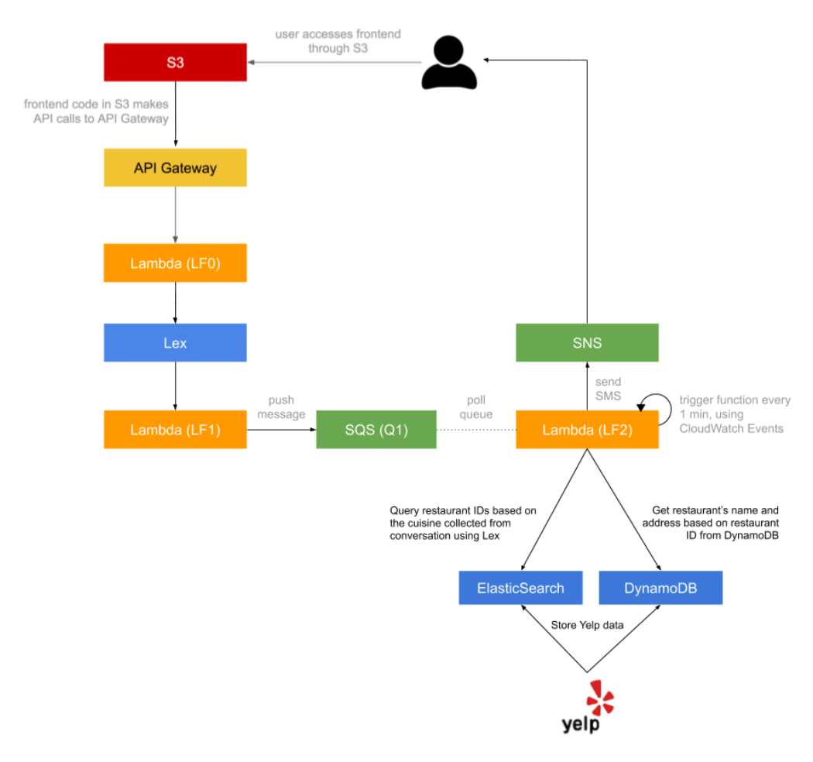

# Chatbot Concierge

## Objective

This is a simple chatbot that briefly converses with the user and finds restaurants based on the conversation from the yelp databse and sends a text message of the recommendations.

This was a part of Cloud Computing course at New York University, and was a way to get used to various AWS services

Following services were used in building this application out

* S3
* API Gateway
* Lambda
* Lex
* SQS
* SNS
* Elastic Search
* DynamoDB
* Yelp API for data sourcing

## Architechture

## Components and Flow

* **S3** is used to host the [frontend](web/) of the site
* **API Gateway** is used to connect the frontend with our chatbot and is defined by [api.yaml](api/api.yaml)
* **Lambda** hosts many functions, one of them is [entry](src/lambda/lf0.py) which acts as an interface between the user and **Lex**
* [lex-validation](src/lambda/lf1.py) is another **Lambda** function that works with **Lex** to validate input and finally send the gathered information to an **SQS** queue
* Every minute through **CloudWatch** events we trigger another **Lambda**, [recommendations](lambdas/recommendations.py].
* [recommendations](src/lambda/lf2) uses the data from the **SQS** entry to search for relevant results using **Elastic Search** and get detailed information about the restaurants from **DynamoDB**.
* Then it constructs and sends a text message filled with recommendations to the user using **SNS**

NOTE:
Data is first scraped using the **Yelp API**, stored in **DynamoDB** for quick access and indexed in **Elastic Search** for quick search.
[Script](src/script/extract_load.py) contains the script used to accomplish this.

## Setup

* Create an API from the [api.yaml](api/api.yaml) with [lf0](src/lambda/lf0.py) integration at AmazonAPIGateway and follow the steps [here](web/)
* Create a S3 bucket to host the website 
* Create a SQS queue 'hw1_dining'
* Create a lex box with [lf1](src/lambda/lf1.py) as a code hook with the following intents
  * GreetingIntent
  * ThankYouIntent
  * DiningSuggestionsIntent collects the following information from the user
    * Location
    * Cuisine
    * Dining Time
    * Number of people
    * Phone number
* Create an elastic search service
* Run the script to load dynamo and elastic search
* Create a cloud watch trigger that invokes [lf2](src/lambda/lf2)

